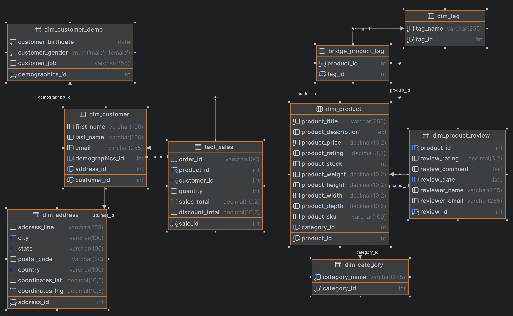

# Orders ETL Pipeline

This is an end-to-end ETL pipeline to pull orders data, transform it, load it into a data warehouse, and provide a visualization dashboard.

## Table of Contents

1. [Introduction](#introduction)
2. [Dataset](#dataset)
3. [Run Data Pipeline](#run-data-pipeline)
   - [Run on Codespaces](#run-on-codespaces)
   - [Run Locally](#run-locally)
4. [Exploring Data Pipeline](#exploring-data-pipeline)
5. [Explore The Database](#explore-the-database)
6. [Architecture](#architecture)
   - [Overview](#overview)
   - [Flow](#flow)
7. [Database Design](#database-design)
   - [Schema Design](#schema-design)
   - [Strengths and Weaknesses](#strengths-and-weaknesses)
   - [Justification](#justification)
8. [Query Optimization Techniques](#query-optimization-techniques)
9. [Email Notification Feature](#email-notification-feature)
10. [Future Considerations](#future-considerations)

## Introduction

This project implements an ETL pipeline to process orders data, transform it, load it into a MySQL data warehouse, and provide a visualization dashboard.

## Dataset

The dataset used in this project is a sample orders dataset that includes information about orders, products, customers, and reviews. The dataset is stored in JSON format and can be found in the [sample_data](./sample_data/dataset.json) directory.

## Run Data Pipeline

### Run on Codespaces

You can run this data pipeline using GitHub Codespaces. Follow the instructions below.

1. Create Codespaces by clicking the `Code` button on the top right, navigating to `Codespaces`, and then clicking on `Create codespaces on main` button.
2. Wait for Codespaces to start, then in the terminal type `make up` and wait for it to complete.
3. After `make up` has completed, go to the `ports` tab, you will find links exposing some ports. The links of interest are:
   - `8080`: the `Airflow` UI.

**Note** Make sure to switch off the Codespaces instance when not in use, as you only have limited free usage; see docs [here](https://github.com/features/codespaces#pricing).

### Run Locally

To run locally, you need:

1. [Git](https://git-scm.com/book/en/v2/Getting-Started-Installing-Git)
2. [GitHub account](https://github.com/)
3. [Docker](https://docs.docker.com/engine/install/) with at least 4GB of RAM and [Docker Compose](https://docs.docker.com/compose/install/).

Clone the repo and run the following commands to start the data pipeline:

```bash
git clone https://github.com/ahgarawani/orders_etl_pipeline.git
cd orders_etl_pipeline
sudo make up
```

You will be prompted to enter an email address which will be used to send you notifications about the DAGs.

Go to:

- [http://localhost:8080](http://localhost:8080) to access the `Airflow` UI.

## Exploring Data Pipeline

Navigate to the `Airflow` UI, you will be prompted for a username and a password, use `airflow` for both. After you have successfully logged in, you will find a single DAG `orders_etl_dag` that has yet to be executed. Run it, wait for it to finish, and the data warehouse will be populated.

## Explore The Database

The database can be accessed using the `Adminer` tool deployed through docker as well and can be accessed as follows:

- **If you run on Codespaces**: Simply go to the `ports` tab, you will find a link exposing the `Adminer` port which is `8081`, click on it.
- **If you run locally**: Simply go to [http://localhost:8081](http://localhost:8081).

afterwards use the following credentials:

- **System**: MySQL
- **Server**: mysql-dwh
- **Username**: root
- **Password**: 1234
- **Database**: sales_analytics_db

## Architecture

### Overview

The architecture is comprised of the following components:

1. **`Airflow`**: Used to schedule and orchestrate DAGs.
2. **`MySQL`**: Used as our data warehouse.
3. **`Pandas`**: Used for data transformation and remodeling.

All of the components are running as Docker containers.

### Flow

First, the containers are all spun up, and the Airflow DAG needs to be executed manually.

Second, the DAG starts by downloading or extracting the dataset and storing it locally.

Third, the dataset is then transformed and remodeled following the snowflake schema using `Pandas`.



Fourth, the transformed data is then loaded into the MySQL warehouse, ready to be consumed by a BI software.

## Database Design

### Schema Design

The database schema is designed using a star schema, which includes dimension tables and a fact table. The schema can be found in the [init.sql](./containers/MySQL/init.sql) file.

### Strengths and Weaknesses

**Strengths:**

- Simplifies complex queries.
- Improves query performance due to denormalization.
- Easy to understand and maintain.

**Weaknesses:**

- Redundant data can lead to increased storage requirements.
- Updates and inserts can be slower due to denormalization.

### Justification

The star schema was chosen because it simplifies complex queries and improves query performance, which is essential for analytical workloads. The denormalized structure allows for faster retrieval of data, making it suitable for reporting and BI tools.

## Query Optimization Techniques

To enhance query performance, the following optimization techniques were used:

- **Indexes**: Added indexes on frequently queried columns to speed up data retrieval.
- **Denormalization**: Used a star schema to reduce the number of joins required in queries.
- **Partitioning**: Considered partitioning large tables to improve query performance and manageability.

## Email Notification Feature

The DAG includes an email notification feature that sends an email if a task fails. The email address for notifications can be set when running the `make up` command. If no email is provided, the feature is disabled.

## Future Considerations

1. Writing unit tests, DAG run tests, and integration tests.
2. Using Terraform to provision resources on a cloud service like AWS.
3. Implementing data validation and quality checks.
4. Adding more advanced query optimization techniques.
